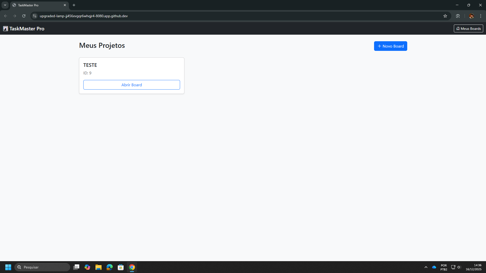
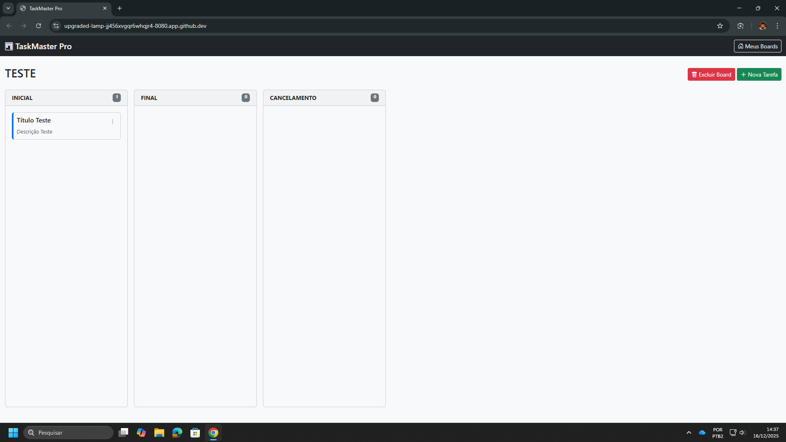

# 📋 TaskMaster Pro - Kanban Board API


Um gerenciador de tarefas estilo **Kanban** robusto e eficiente, construído do zero focando em performance e arquitetura limpa. O projeto utiliza **Java puro (JDBC)** para máxima compreensão de como as coisas funcionam "debaixo do capô", sem a "mágica" de frameworks pesados de ORM.

---

## 📸 Screenshots

### Visão Geral do Board


### Edição e Bloqueio de Tarefas


---

## 🚀 Funcionalidades

- **Gerenciamento de Boards**: Criação, listagem e exclusão de quadros de tarefas.
- **Fluxo Kanban Automático**: Colunas geradas automaticamente (Inicial, Pendente, Final, Cancelamento).
- **CRUD de Tarefas (Cards)**:
  - Criar tarefas com título e descrição.
  - Editar conteúdo das tarefas.
  - Excluir tarefas.
- **Movimentação Inteligente**: 
  - Regra de negócio que garante a navegação sequencial entre colunas.
  - Validação de status (não permite mover se estiver bloqueado).
- **Sistema de Bloqueio**:
  - Bloqueio de cards com motivo específico.
  - Visualização destacada (vermelho) para cards bloqueados.
  - Histórico de bloqueios e desbloqueios no banco de dados.
- **Frontend SPA**: Interface moderna e responsiva utilizando HTML5, CSS3 (Bootstrap 5) e Vanilla JS.

---

## 🛠️ Tecnologias Utilizadas

- **Linguagem**: Java 21
- **Web Framework**: Javalin (Leve e Performático)
- **Banco de Dados**: MySQL 8
- **Persistência**: JDBC Puro (java.sql) - *Sem Hibernate/JPA*
- **Build Tool**: Maven
- **Infraestrutura**: Docker & Docker Compose
- **Frontend**: HTML, CSS, Bootstrap 5, JavaScript (Fetch API)

---

## ⚙️ Como Rodar o Projeto

### Pré-requisitos
- Java JDK 21+ instalado
- Docker e Docker Compose instalados
- Maven instalado

### Passo 1: Subir o Banco de Dados
Na raiz do projeto, execute o comando para subir o container do MySQL:
```bash
docker-compose up -d
```

### Passo 2: Compilar o Projeto
Gere o arquivo executável (Fat JAR):
```bash
mvn clean package
```

### Passo 3: Executar
Rode a aplicação:
```bash
java -jar target/board-task-manager-1.0-SNAPSHOT.jar
``` 
Acesse no seu navegador: http://localhost:8080

## 🔌 Documentação da API
A API segue os princípios REST. Abaixo as principais rotas:

| Método | Rota | Descrição | Payload (JSON) |
| :--- | :--- | :--- | :--- |
| `GET` | `/boards` | Lista todos os boards | - |
| `POST` | `/boards` | Cria um novo board | `{ "name": "Projeto X" }` |
| `GET` | `/boards/{id}` | Traz colunas e cards de um board | - |
| `DELETE` | `/boards/{id}` | Exclui um board e seus cards | - |
| `POST` | `/boards/{id}/cards` | Cria um card na coluna inicial | `{ "title": "...", "description": "..." }` |
| `POST` | `/cards/{id}/move` | Move o card para a próxima coluna | - |
| `PUT` | `/cards/{id}` | Edita o conteúdo do card | `{ "title": "...", "description": "..." }` |
| `DELETE` | `/cards/{id}` | Exclui um card | - |
| `POST` | `/cards/{id}/block` | Bloqueia o card | `{ "reason": "Falta insumo" }` |
| `POST` | `/cards/{id}/unblock` | Desbloqueia o card | `{ "reason": "Resolvido" }` |

---

## 👨‍💻 Aprendizados

Este projeto foi desenvolvido com foco em entender os fundamentos do Backend Java:
1. **Conexão JDBC**: Gerenciamento manual de conexões, PreparedStatement e ResultSet.
2. **Padrão DAO**: Separação clara entre regra de negócio (Service) e acesso a dados (DAO).
3. **DTOs**: Uso de Data Transfer Objects para não expor as Entidades do banco diretamente.
4. **HTTP & REST**: Manipulação correta de verbos (GET, POST, PUT, DELETE) e Status Codes (201, 204, 404, 500).

---

Desenvolvido com ☕ e Java.